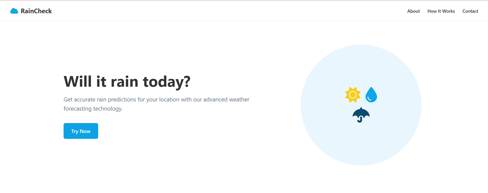
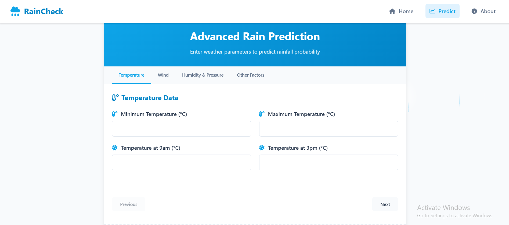

# Rain Prediction System

This repository contains a Jupyter Notebook for a **Rain Prediction System**. The notebook demonstrates a complete data preprocessing and exploratory data analysis (EDA) pipeline for weather data, preparing it for machine learning models to predict rainfall.

---

## 🚀 Live Demo

The deployed version of this project is available here:  
**[Rain Prediction System - Live](<https://rain-prediction-2e4be84abef7.herokuapp.com/>)**

---

## Features

- **Data Cleaning:** Handles missing values for both categorical and numerical features.
- **Feature Selection:** Drops irrelevant columns.
- **Outlier Detection & Capping:** Identifies and caps outliers using the IQR method.
- **Normalization:** Scales numeric features to [0, 1] using MinMaxScaler.
- **Encoding:** Converts categorical rain indicators to binary.
- **EDA:** Includes univariate, bivariate, and multivariate analysis with visualizations.
- **Feature Correlation:** Analyzes feature relationships with the target variable.
- **Export:** Saves the cleaned dataset for further modeling.

---

## Screenshots

Add screenshots of your notebook, EDA plots, or deployed app here.  
For example:





---

## Notebook Workflow

1. **Import Libraries**
2. **Load Data**
3. **Inspect Data:** `info()`, `describe()`, `head()`
4. **Identify Categorical & Numeric Columns**
5. **Handle Missing Values**
   - Categorical: Fill with mode
   - Numeric: Fill with median
6. **Drop Irrelevant Columns**
7. **Remove Duplicates**
8. **Outlier Detection & Capping**
9. **Normalize Numeric Features**
10. **Encode Categorical Variables**
11. **Export Cleaned Data**
12. **EDA**
    - Univariate: Histograms, boxplots, stats
    - Bivariate/Multivariate: Scatter plots, heatmaps, pairplots
13. **Feature Correlation Analysis**

---

## Usage
1. **Prepare your data:**
   Place your raw weather data as `weather.csv` in the project directory.

2. **Run the notebook:**
   Open `Weather_Data_Analysis_(Rain_Prediction).ipynb` in VS Code or Jupyter and run all cells.

3. **Output:**
   The processed dataset will be saved as `weather_final_dataset.csv`.

---

## Requirements

All dependencies are listed in `requirements.txt`.  
**Key packages:**
- Python 3.x
- pandas==2.2.3
- numpy==2.2.5
- scikit-learn==1.6.1
- matplotlib
- seaborn

**Full requirements:**
```
asgiref==3.8.1
dj-database-url==2.3.0
Django==5.2.1
django-heroku==0.3.1
gunicorn==23.0.0
joblib==1.5.0
numpy==2.2.5
packaging==25.0
pandas==2.2.3
psycopg2==2.9.10
python-dateutil==2.9.0.post0
pytz==2025.2
scikit-learn==1.6.1
scipy==1.15.3
six==1.17.0
sqlparse==0.5.3
threadpoolctl==3.6.0
typing_extensions==4.13.2
tzdata==2025.2
whitenoise==6.9.0
```

---

## Example Code Snippet

```python
import pandas as pd
import numpy as np
from sklearn.preprocessing import MinMaxScaler

# Load data
df = pd.read_csv('weather.csv')

# Fill missing categorical with mode
object_cols = df.select_dtypes(include='object').columns
for col in object_cols:
    df[col] = df[col].fillna(df[col].mode()[0])

# Fill missing numeric with median
num_cols = df.select_dtypes(include='number').columns
for col in num_cols:
    df[col] = df[col].fillna(df[col].median())

# Drop irrelevant columns
columns_to_drop = ['Date', 'RISK_MM', 'Location', 'WindDir9am', 'WindDir3pm', 'WindGustDir']
df = df.drop(columns=columns_to_drop)

# Remove duplicates
df = df.drop_duplicates()

# Outlier capping
Q1 = df[num_cols].quantile(0.25)
Q3 = df[num_cols].quantile(0.75)
IQR = Q3 - Q1
lower_bound = Q1 - 1.5 * IQR
upper_bound = Q3 + 1.5 * IQR
for col in num_cols:
    df[col] = df[col].clip(lower=lower_bound[col], upper=upper_bound[col])

# Normalize
scaler = MinMaxScaler()
df[num_cols] = scaler.fit_transform(df[num_cols])

# Encode rain columns
df['RainToday'] = df['RainToday'].map({'Yes': 1, 'No': 0}).astype('Int64')
df['RainTomorrow'] = df['RainTomorrow'].map({'Yes': 1, 'No': 0}).astype('Int64')

# Save cleaned data
df.to_csv('weather_final_dataset.csv', index=False)
```

---

## License

This project is licensed under the MIT License.

---

**Notebook:** `Weather_Data_Analysis_(Rain_Prediction).ipynb`
